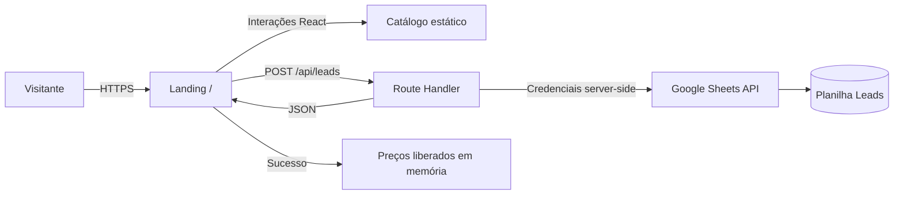

# Arquitetura do projeto

Este documento registra a fundação arquitetural da My Pet Landing, separando o
que existe hoje das diretrizes para a evolução do produto.

## 1. Objetivo

A aplicação funciona como porta de entrada digital para o atacado B2B da My Pet
Brasil. Sua responsabilidade inicial é apresentar a oferta, permitir a
exploração de um catálogo e converter visitantes qualificados em leads.

Princípios da fundação:

- manter a experiência pública simples e rápida;
- executar integrações e manipular segredos somente no servidor;
- separar progressivamente conteúdo, interface, regras e infraestrutura;
- validar dados nas fronteiras da aplicação;
- permitir a troca do Google Sheets por um CRM ou banco sem reescrever a UI;
- observar conversão e falhas sem coletar dados além do necessário.

## 2. Estado atual



### Camadas atuais

| Camada | Local | Responsabilidade |
| --- | --- | --- |
| Shell da aplicação | `app/layout.tsx` | HTML raiz, fontes e metadados |
| Apresentação e interação | `app/page.tsx` | Conteúdo, catálogo, filtros, modal e formulário |
| Estilos globais | `app/globals.css` | Tailwind e tokens globais básicos |
| API/BFF | `app/api/leads/route.ts` | Receber e validar minimamente o lead |
| Integração externa | `googleapis` | Autenticar e gravar no Google Sheets |
| Configuração | `.env.local` | Credenciais e identificador da planilha |

`app/page.tsx` é um Client Component porque usa estado e eventos. O layout
permanece um Server Component. O endpoint `/api/leads` é um Route Handler
executado no servidor; por isso, as credenciais do Google não entram no bundle
do navegador.

## 3. Fluxos principais

### 3.1 Navegação no catálogo

1. Produtos e categorias são carregados de constantes locais.
2. O usuário escolhe uma categoria.
3. O React filtra os produtos no navegador.
4. Enquanto `unlocked` for falso, a UI oculta os preços.

### 3.2 Cadastro do lead

1. Um CTA abre o modal.
2. O formulário controla os valores em estado local.
3. O cliente envia `nome`, `empresa`, `whatsapp` e `cnpj` para `/api/leads`.
4. O Route Handler exige nome, empresa e WhatsApp.
5. O servidor lê as credenciais do ambiente e cria um cliente Google.
6. O lead é anexado a `Leads!A:E`.
7. A resposta bem-sucedida fecha o modal e altera `unlocked` para verdadeiro.

### 3.3 Falhas

Erros de envio são apresentados ao usuário por uma mensagem genérica. No estado
atual, falhas de configuração, JSON inválido e erros do Google não possuem uma
classificação própria nem observabilidade estruturada.

## 4. Fronteiras de segurança

```text
Navegador (não confiável)
  └── dados do formulário
        ↓ validação obrigatória
Servidor Next.js (fronteira de confiança)
  ├── GOOGLE_CREDENTIALS
  ├── GOOGLE_SHEET_ID
  └── chamada autenticada
        ↓
Google Sheets (serviço externo)
```

Regras:

- nunca prefixar credenciais com `NEXT_PUBLIC_`;
- nunca retornar credenciais ou erros internos completos ao cliente;
- considerar todo campo recebido do navegador como não confiável;
- aplicar validação, normalização e limites no servidor;
- conceder à conta de serviço apenas o acesso necessário;
- não usar o estado `unlocked` como autorização para dados comerciais reais;
- manter arquivos `.env*` fora do repositório.

O desbloqueio atual é apenas uma condição visual em memória. Um usuário pode
inspecionar o JavaScript entregue ao navegador, e o estado se perde ao
recarregar a página.

## 5. Arquitetura fundação recomendada

À medida que a landing crescer, a estrutura deve evoluir por responsabilidades:

```text
app/
├── api/
│   └── leads/
│       └── route.ts
├── _components/
│   ├── catalog/
│   ├── lead-form/
│   └── sections/
├── layout.tsx
└── page.tsx
lib/
├── env.ts
├── leads/
│   ├── schema.ts
│   ├── service.ts
│   └── types.ts
└── integrations/
    └── google-sheets.ts
```

Responsabilidades propostas:

- `page.tsx`: composição da rota, sem concentrar toda a implementação visual;
- `_components`: componentes de apresentação e ilhas interativas;
- `schema.ts`: contrato e validação dos dados recebidos;
- `service.ts`: caso de uso de criação de lead;
- `google-sheets.ts`: detalhes do fornecedor externo;
- `env.ts`: leitura e validação centralizada das variáveis de ambiente.

Essa divisão deve ser introduzida quando houver mudança funcional relevante,
evitando abstrações prematuras.

## 6. Contrato da API

### `POST /api/leads`

Entrada:

```ts
type CreateLeadInput = {
  nome: string;
  empresa: string;
  whatsapp: string;
  cnpj?: string;
};
```

Contrato atual:

| Status | Significado |
| --- | --- |
| `200` | Lead gravado |
| `400` | Campo obrigatório ausente |
| `500` | Falha não tratada |

Contrato recomendado:

| Status | Significado |
| --- | --- |
| `201` | Lead criado |
| `400` | Corpo inválido ou campo malformado |
| `409` | Lead duplicado, se essa regra for adotada |
| `429` | Limite de requisições excedido |
| `502` | Dependência externa indisponível |
| `500` | Erro interno inesperado |

As respostas devem usar uma forma estável, por exemplo:

```json
{
  "ok": false,
  "error": {
    "code": "INVALID_INPUT",
    "message": "Revise os campos informados."
  }
}
```

## 7. Dados e integrações

### Google Sheets

O Sheets é adequado para a fase inicial por reduzir o custo operacional, mas
não deve concentrar regras de negócio. A aplicação deve tratá-lo como um
adaptador substituível.

Limitações a acompanhar:

- concorrência e cotas da API;
- ausência de garantias fortes contra duplicidade;
- consultas e relatórios limitados;
- gestão manual de permissões;
- dificuldade de auditoria e evolução de esquema.

Quando esses limites forem relevantes, `service.ts` poderá passar a escrever em
um CRM ou banco de dados, preservando o contrato consumido pela interface.

### Catálogo

Hoje o catálogo é uma coleção estática no bundle do cliente. A evolução natural
é disponibilizá-lo por uma camada server-side que possa combinar banco, ERP ou
API externa, com cache e revalidação definidos conforme a frequência de
atualização.

Preços protegidos não devem ser enviados ao navegador antes da autorização.

## 8. Qualidade e operação

### Validação mínima por mudança

```bash
npm run lint
npm run build
```

Para alterações no fluxo de leads, validar também:

- cadastro válido;
- ausência de cada campo obrigatório;
- erro de credencial;
- planilha ou aba inexistente;
- indisponibilidade do Google;
- repetição rápida de envios;
- experiência em viewport móvel.

### Observabilidade

A fundação deve registrar no servidor:

- identificador da requisição;
- resultado e duração da integração;
- código de erro normalizado;
- data/hora;
- ambiente e versão da aplicação.

Não registrar credenciais, corpo completo do lead, CNPJ ou WhatsApp em logs.
Métricas de conversão devem usar eventos e identificadores com o mínimo de dados
pessoais possível.

## 9. Decisões arquiteturais

| Decisão | Motivo | Consequência |
| --- | --- | --- |
| App Router | Convenção atual do Next.js usado pelo projeto | Rotas e APIs ficam sob `app/` |
| Client Component na landing | Filtros, modal e formulário exigem interação | A página inteira entra no bundle cliente hoje |
| Route Handler para leads | Mantém segredo e integração fora do navegador | Requer runtime server-side |
| Google Sheets como destino inicial | Operação simples para MVP | Escalabilidade e consistência limitadas |
| Variáveis privadas sem `NEXT_PUBLIC_` | Evita exposição das credenciais | Dev e produção precisam configurar o ambiente |
| Catálogo estático no MVP | Entrega rápida sem dependência de backend | Dados e preços não são fonte de verdade |

## 10. Próximos marcos

1. Corrigir metadados, idioma e conteúdo de produção.
2. Extrair componentes da página sem alterar o comportamento.
3. Adicionar schema de validação e respostas de erro estáveis.
4. Isolar a integração com Google Sheets em um adaptador.
5. Implementar proteção contra spam e observabilidade.
6. Definir política de privacidade e retenção de leads.
7. Integrar catálogo, estoque e preço a uma fonte de verdade.
8. Adicionar autenticação/sessão se o preço exigir controle de acesso real.
